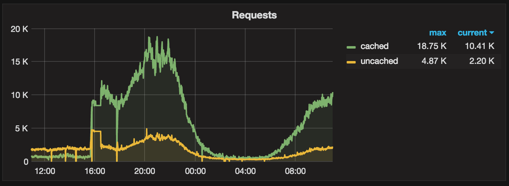
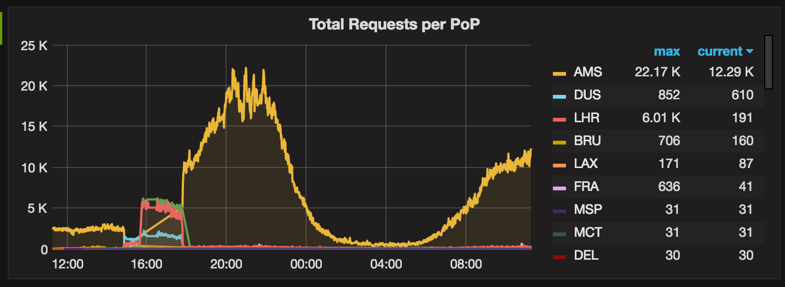
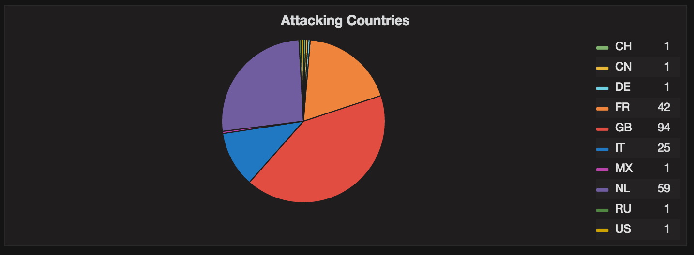

# Cloudflare exporter for Prometheus

A very simple Prometheus exporter that exposes metrics from Cloudflare's colocations API as described in the [API documentation](https://api.cloudflare.com/#zone-analytics-analytics-by-co-locations). Sadly, this is for Cloudflare Enterprise customers only.
It'll expose metrics per PoP and shows requests, bandwidth and threats.

Please note that because of how the Cloudflare API works this exporter will only return statistics from `now() - 5 minutes`.

### Try it

Running the container:

```
docker run \
 -d \
 -p 9199:9199 \
 -e SERVICE_PORT=9199 \
 -e ZONE=example.com \
 -e AUTH_KEY=deadbeefcafe \
 -e AUTH_EMAIL=admin@example.com \
 wehkamp/prometheus-cloudflare-exporter:1.0
```
```
Fetching data
```

### Metrics
The exporter exposes the following metrics, all returned per PoP:

| Name                                 | Description                                               |  Type |
|:-------------------------------------|:----------------------------------------------------------|:-----:|
| `cloudflare_pop_received_requests`   | cached and uncached requests received on an edge-location | gauge |
| `cloudflare_pop_bandwidth_bytes`     | cached and uncached bandwidth sent from an edge-location  | gauge |
| `cloudflare_pop_http_responses_sent` | breakdown of requests per HTTP code                       | gauge |
| `cloudflare_pop_threats_seen`        | number of threats identified received in at this location | gauge |
| `cloudflare_pop_threat_types`        | types of threats seen                                     | gauge |
| `cloudflare_pop_threat_countries`    | countries causing threats                                 | gauge |

Random scrape result:

```python
# HELP cloudflare_pop_http_responses_sent Breakdown per HTTP response code.
# TYPE cloudflare_pop_http_responses_sent gauge
cloudflare_pop_http_responses_sent{colo_id="BRU",http_status="200",zone="example.com"} 25.0
cloudflare_pop_http_responses_sent{colo_id="BRU",http_status="302",zone="example.com"} 1.0
cloudflare_pop_http_responses_sent{colo_id="BRU",http_status="204",zone="example.com"} 2.0
# HELP cloudflare_pop_threat_countries Threat breakdown per threat country.
# TYPE cloudflare_pop_threat_countries gauge
# HELP cloudflare_pop_threat_types Threat breakdown per threat type.
# TYPE cloudflare_pop_threat_types gauge
# HELP cloudflare_pop_threats_seen Threats identified.
# TYPE cloudflare_pop_threats_seen gauge
cloudflare_pop_threats_seen{colo_id="BRU",zone="example.com"} 0.0
# HELP cloudflare_pop_bandwidth_bytes Bandwidth sent from this PoP location.
# TYPE cloudflare_pop_bandwidth_bytes gauge
cloudflare_pop_bandwidth_bytes{colo_id="BRU",type="cached",zone="example.com"} 404362.0
cloudflare_pop_bandwidth_bytes{colo_id="BRU",type="uncached",zone="example.com"} 68411.0
# HELP cloudflare_pop_received_requests Requests received at this PoP location.
# TYPE cloudflare_pop_received_requests gauge
cloudflare_pop_received_requests{colo_id="BRU",type="cached",zone="example.com"} 10.0
cloudflare_pop_received_requests{colo_id="BRU",type="uncached",zone="example.com"} 18.0
```

### Dashboard

A sample Grafana dashboard is [included](grafana-cloudflare-dashboard.json) to visualize the information.

Overview of requests, cached and uncached:


Overview of requests served per Cloudflare network point-of-presence:


Overview of actual countries that cause threats:


### Todo

- [ ] Implement a way to store datapoints in Prometheus using timestamps received from Cloudflare. This should remove the delay as we currently have it.
